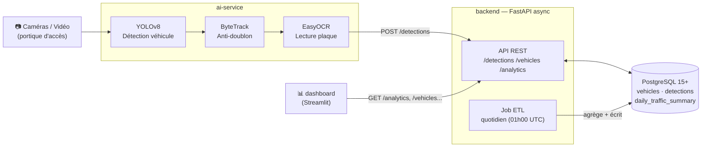
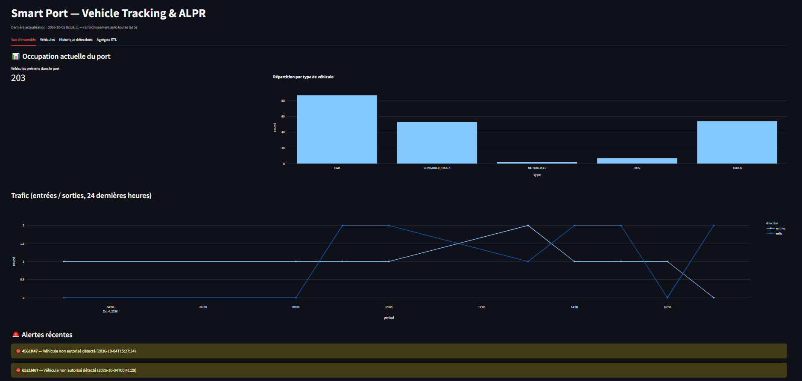
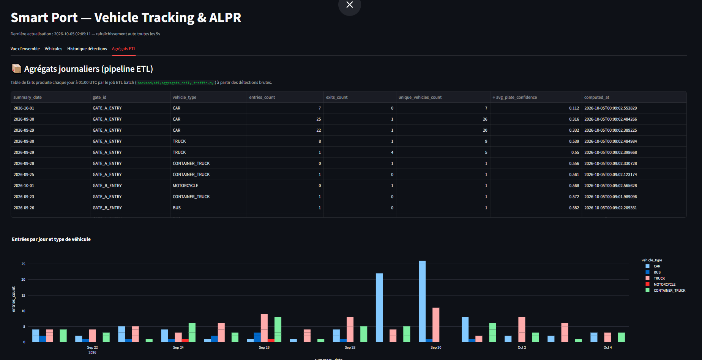
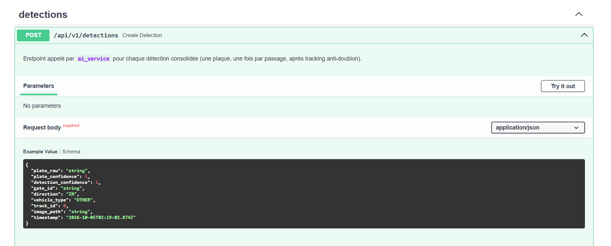

#  Smart Port Vehicle Tracking & License Plate Recognition System

[](https://github.com/<TON_USERNAME>/smart-port-vehicle-tracking/actions/workflows/ci.yml)
[](LICENSE)

Système end-to-end de suivi, contrôle d'accès et traçabilité des véhicules en milieu portuaire : détection vidéo temps réel, reconnaissance de plaques (ALPR/ANPR), API REST asynchrone, base PostgreSQL indexée et dashboard de supervision.

## Architecture



- **ai-service** : capture le flux vidéo, détecte véhicule + plaque (YOLOv8), suit les objets (ByteTrack) pour éviter les doublons, lit la plaque (EasyOCR), et pousse chaque détection consolidée vers le backend.
- **backend** : FastAPI async (SQLModel/SQLAlchemy async + Alembic), expose une API REST pour les détections, véhicules et analytics, et héberge le job ETL batch (agrégation journalière, voir section dédiée plus bas).
- **db** : PostgreSQL avec index sur `plate_number` et `timestamp`.
- **dashboard** : Streamlit, consomme l'API pour l'état temps réel du port, l'historique, les alertes et les agrégats ETL.

## Aperçu visuel

<!--
  Captures à ajouter dans docs/screenshots/ (voir docs/screenshots/README.md
  pour les instructions détaillées de prise de capture).
-->

| Vue d'ensemble | Agrégats ETL |
|---|---|
|  |  |

| Documentation API (Swagger) |
|---|
|  |

## Démarrage rapide

```bash
cp .env.example .env
# éditer .env si besoin (mot de passe DB, source vidéo, etc.)

docker compose up --build
```

| Service    | URL                              |
|------------|-----------------------------------|
| API Docs   | http://localhost:8000/docs        |
| Dashboard  | http://localhost:8501             |
| PostgreSQL | localhost:5432                    |

## Tests

```bash
docker compose exec backend pytest -v
```

Les tests (16, backend) tournent sur une **base SQLite de test isolée**, créée et détruite automatiquement — ils ne touchent jamais la base Postgres de développement ni tes données de démo seedées. Couverture : upsert véhicule/statut, validation des payloads, non-régression du bug timezone-aware/naive, filtrage, agrégation ETL et son idempotence (relancer le job sur la même date ne duplique jamais rien).

## Structure du dépôt

```text
smart-port-tracking/
├── docker-compose.yml
├── .env.example
├── backend/        # API REST FastAPI (async) + ORM + migrations Alembic
├── ai_service/      # Pipeline YOLOv8 + tracking + OCR
└── dashboard/        # Interface de supervision Streamlit
```

## Flux de données

1. `ai_service/main_ai.py` lit le flux vidéo (webcam/RTSP/fichier) frame par frame.
2. `detector.py` détecte véhicules puis régions de plaque (YOLOv8), applique OCR (EasyOCR).
3. `tracker.py` associe les détections à des `track_id` persistants (ByteTrack) pour n'émettre **qu'une seule** lecture consolidée par passage de véhicule (vote majoritaire sur les lectures OCR successives).
4. Une détection consolidée est envoyée en `POST /api/v1/detections` au backend.
5. Le backend upsert le véhicule (par plaque), enregistre l'événement
   d'entrée/sortie, et calcule le statut courant (`IN_PORT` / `OUT`).
6. Le dashboard interroge `/api/v1/analytics/*` et `/api/v1/vehicles` pour afficher l'occupation en temps réel et l'historique.

## Base de données

Tables principales :

- `vehicles` : plaque (unique, indexée), type de véhicule, statut courant, première/dernière apparition.
- `detections` : événement horodaté (indexé) — plaque brute lue, score OCR, score de détection, `gate_id`, direction (`IN`/`OUT`), image (chemin/URI), `track_id`.
- `daily_traffic_summary` : **table de faits** agrégée (jour × porte × type de véhicule), produite par le job ETL — voir section suivante.

## Pipeline ETL (batch) : des événements bruts à l'analytique agrégée

En plus de l'API temps réel, le projet inclut un vrai petit pipeline de
données batch, pattern **Extract → Transform → Load** classique :

- **Extract + Transform** (`backend/etl/aggregate_daily_traffic.py`) :
  agrégation SQL (via `FILTER`/`GROUP BY` côté Postgres, pas en Python) des `detections` d'une journée, par `gate_id` et `vehicle_type` — comptage des entrées/sorties, véhicules uniques, confiance OCR moyenne.
- **Load** : écriture dans `daily_traffic_summary` avec un pattern
  d'**idempotence par rechargement de partition** (delete + insert sur la date ciblée) — relancer le job plusieurs fois sur la même date ne duplique jamais rien.
- **Orchestration** (`backend/etl/scheduler.py`) : un scheduler APScheduler intégré au process FastAPI déclenche le job chaque jour à 01:00 UTC (démarré/arrêté via les hooks `startup`/`shutdown` de l'app).
- **Exposition** : `GET /api/v1/analytics/daily-summary`, visualisé dans
  l'onglet « Agrégats ETL » du dashboard.

Exécution manuelle (utile en dev/démo, sans attendre le scheduler) :

```bash
docker compose exec backend python -m etl.aggregate_daily_traffic
docker compose exec backend python -m etl.aggregate_daily_traffic --date 2026-09-28
```

### Évolution possible : passer en streaming (Kafka / Redis Streams)

Le flux actuel est **synchrone** : `ai-service` fait un `POST /detections` direct vers le backend. Pour un vrai contexte multi-caméras à fort volume, l'étape suivante serait de **découpler ingestion et persistance** via une
file de messages :

1. `ai-service` devient un **producer** : il publie chaque détection
   consolidée sur un topic Kafka (ou un stream Redis) au lieu d'appeler  l'API directement.
2. Un **worker consumer** (nouveau service, ex. `backend/workers/detection_consumer.py`)
   lit le topic en continu et appelle `crud.create_detection()`.
3. Avantages : absorption de pics de charge (plusieurs caméras simultanées), résilience (si le backend tombe, les messages s'accumulent dans la file sans perte), possibilité de brancher d'autres consumers en parallèle (ex. un second worker qui alimente un moteur de recherche ou un système d'alerte temps réel) sans toucher au producer.
4. Coût : un service supplémentaire dans `docker-compose.yml` (Kafka+Zookeeper ou simplement Redis), gestion des accusés de réception (ack) et des messages en échec (dead-letter queue).

Non implémenté ici pour rester simple côté infra, mais c'est l'évolution
naturelle si le volume de caméras/détections grandit.

## Jeu de données de démo (seeding)

Pour avoir un dashboard qui semble « vécu » sans rejouer des vidéos de test à chaque fois, `backend/scripts/seed_fake_data.py` génère plusieurs semaines de trafic synthétique réaliste (pics matin/après-midi, flotte de véhicules récurrents, quelques véhicules non autorisés pour les alertes) directement en base — en réutilisant `crud.create_detection()`, donc 100% cohérent avec ce que produirait le vrai pipeline. Il rejoue ensuite le job ETL sur toute
la période pour peupler aussi la table de faits agrégée.

```bash
# 30 jours d'historique, ~25 événements/jour (valeurs par défaut)
docker compose exec backend python -m scripts.seed_fake_data

# Personnalisé : 60 jours, plus de trafic, en repartant d'une base vide
docker compose exec backend python -m scripts.seed_fake_data --days 60 --events-per-day 40 --reset
```

## Modèle de détection de plaques

Entraîner un modèle YOLOv8 dédié aux plaques nécessite un GPU et un dataset annoté — pour éviter cette étape lourde, le projet utilise un modèle pré-entraîné existant :
- **Source** : [Muhammad-Zeerak-Khan/Automatic-License-Plate-Recognition-using-YOLOv8](https://github.com/Muhammad-Zeerak-Khan/Automatic-License-Plate-Recognition-using-YOLOv8) (licence **MIT**)
- **Fichier** : `license_plate_detector.pt` → copié dans
`ai_service/models/plate_detector.pt`
- Le poids n'est **pas versionné dans git** (binaire, voir `.gitignore`) ; il est soit déjà présent localement (livré avec ce projet), soit re-téléchargé automatiquement au build Docker (`ai_service/Dockerfile`)
via `ai_service/scripts/download_plate_model.sh`.
- Si le fichier est absent et le téléchargement échoue (pas de réseau au build), `detector.py` bascule automatiquement sur une heuristique de repli (tiers inférieur du véhicule) — le pipeline continue de fonctionner, avec une précision moindre.

